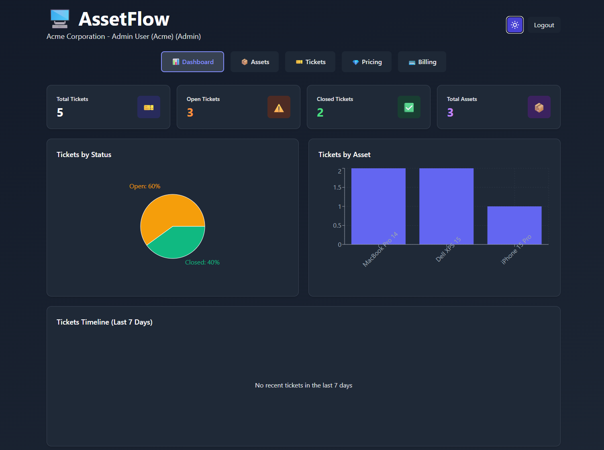
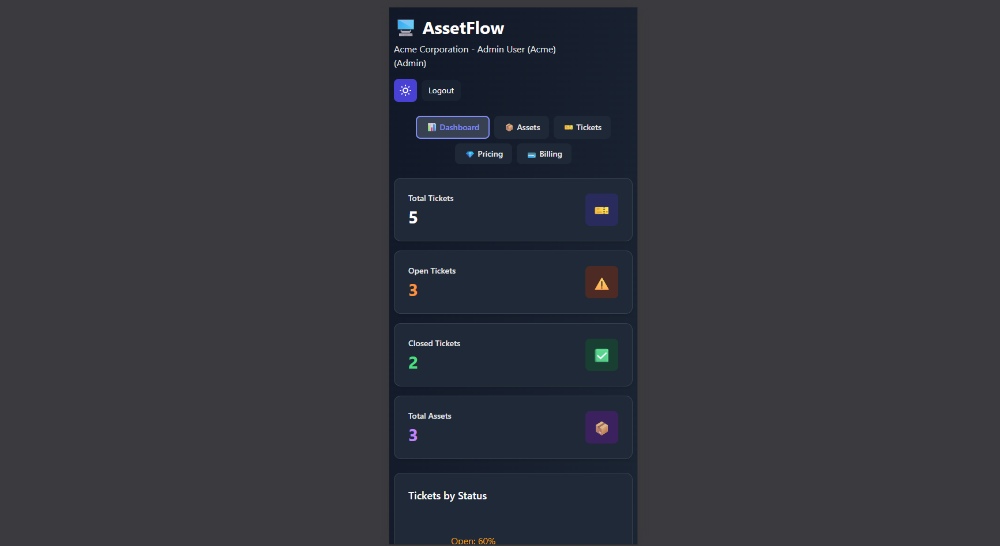

# AssetFlow Ticketing Platform

## 🚩 Problem

Companies lose time and money due to manual asset management and failure reporting. AssetFlow automates this process, centralizes information, and improves traceability.

## 📸 Screenshots

<p align="center">
   
   
   
</p>

## 🚀 Why AssetFlow?

- Automates asset and ticket management
- Modern and visual dashboard
- Multi-tenant: each company sees only its own data
- Responsive UI with dark mode
- Demo mode for portfolio and testing (no payment required)

## ⚡ Tech Stack

React · Vite · Tailwind CSS · Node.js · Express · Prisma · PostgreSQL

## ✨ Key Features

- JWT authentication and roles (Admin/Employee)
- Asset and ticket management
- Subscriptions (FREE, PRO, ENTERPRISE)
- Email notifications
- Demo mode for portfolio

## 🚦 Quick Start

```bash
git clone https://github.com/al7474/assetflow-ticketing-platform.git
cd assetflow-ticketing-platform
cd backend && npm install && npm run dev
# In another terminal:
cd ../frontend && npm install && npm run dev
```

## 📚 More Information & Documentation

- [Authentication Guide](docs/AUTH_IMPLEMENTATION.md)
- [Multi-Tenancy](docs/MULTI_TENANCY.md)
- [Dark Mode](docs/DARK_MODE.md)
- [Demo Mode Testing](docs/DEMO_MODE_TESTING.md)
- [Improvements & Roadmap](docs/IMPROVEMENTS.md)
- [Railway Deployment](docs/RAILWAY_DEPLOYMENT.md)
git clone https://github.com/youruser/assetflow-ticketing-platform.git
cd assetflow-ticketing-platform
cd backend && npm install && npm run dev
# In another terminal:
cd ../frontend && npm install && npm run dev
```

## 📚 More Information & Documentation

- [Authentication Guide](docs/AUTH_IMPLEMENTATION.md)
- [Multi-Tenancy](docs/MULTI_TENANCY.md)
- [Dark Mode](docs/DARK_MODE.md)
- [Demo Mode Testing](docs/DEMO_MODE_TESTING.md)
- [Improvements & Roadmap](docs/IMPROVEMENTS.md)
- [Railway Deployment](docs/RAILWAY_DEPLOYMENT.md)

---

npx prisma generate && npx prisma migrate deploy && node index.js
