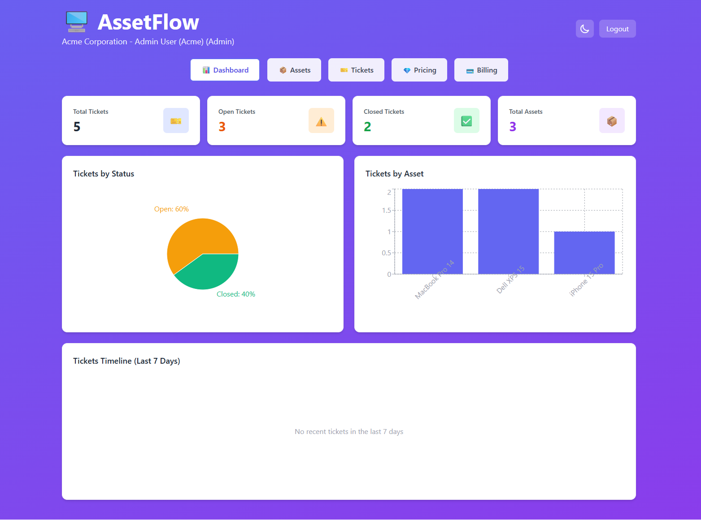
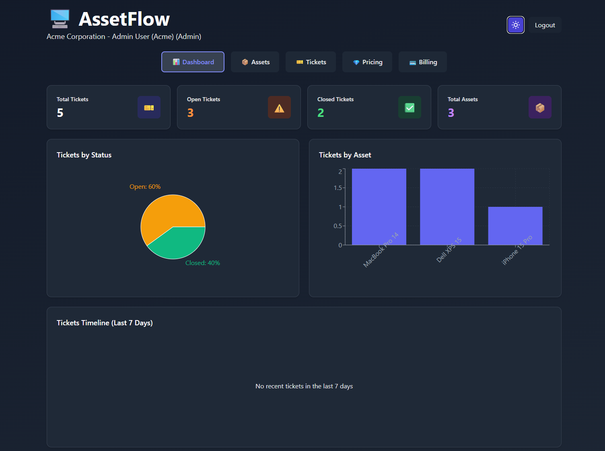

# AssetFlow Ticketing Platform

Automates asset and ticket management for companies, centralizing information and improving traceability. Designed for modern teams seeking efficiency, clear visualization, and multi-tenancy.

## 🚀 Quick Demo

You can try the main AssetFlow workflow with the demo user:

- **User:** demo@demo.com  
- **Password:** demo123

1. Log in with the demo user.
2. Explore the dashboard, create and manage tickets and assets.
3. Switch between light/dark mode and experience multi-tenancy.

> If you have a deployed URL, add it here:  
> [Online Demo](https://assetflow-ticketing-platform.vercel.app)

## 📸 Screenshots

<p align="center">
	
	
</p>

- Modern dashboard (light and dark mode)
- Responsive design for desktop and mobile

> You can add a GIF or short video here to showcase the main workflow.

## ✨ Key Features

- JWT authentication and role management (Admin/Employee)
- Asset and ticket management
- Multi-tenancy: each company sees only its own data
- Subscription plans (FREE, PRO, ENTERPRISE)
- Email notifications
- Demo mode for portfolio and testing
- Responsive UI with light/dark mode

## ⚡ Tech Stack

- React
- Vite
- Tailwind CSS
- Node.js
- Express
- Prisma
- PostgreSQL

## 🚦 Installation & Usage

Clone the repository and start both backend and frontend:

```bash
git clone https://github.com/al7474/assetflow-ticketing-platform.git
cd assetflow-ticketing-platform

# Start backend
cd backend
npm install
npm run dev

# In another terminal, start frontend
cd ../frontend
npm install
npm run dev
```

> The demo user is available after setup.  
> For more details, see the documentation in the `docs/` folder.

## 📚 Documentation

- [Authentication Guide](docs/AUTH_IMPLEMENTATION.md)
- [Multi-Tenancy](docs/MULTI_TENANCY.md)
- [Dark Mode](docs/DARK_MODE.md)
- [Demo Mode Testing](docs/DEMO_MODE_TESTING.md)
- [Improvements & Roadmap](docs/IMPROVEMENTS.md)
- [Testing Guide](docs/TESTING_GUIDE.md)
